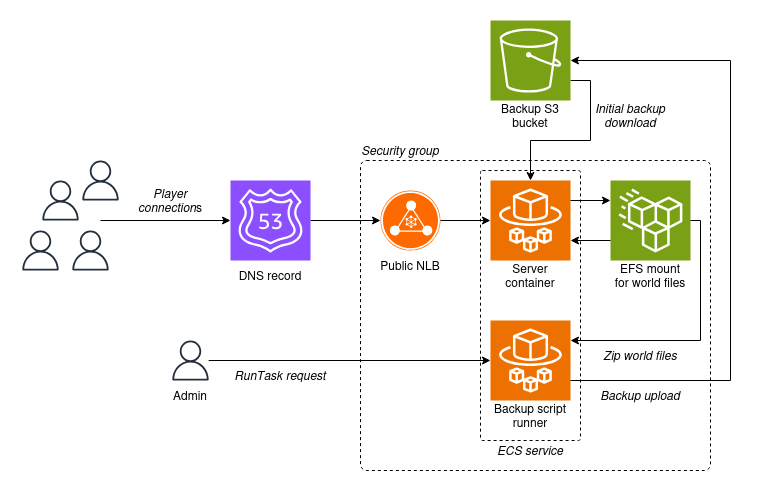

# docker-minecraft

Standalone Docker-based Minecraft server setup with backups, primarily for
Raspberry Pi 5 with 8 GB of RAM. Also contains Terraform scripts for deployment
into AWS.

* [Prerequisites](#prerequisites)
* [Customizations](#customizations)
* [Docker build and run](#docker-build-and-run)
* [Stopping the server](#stopping-the-server)
* [Backups](#backups)
* [AWS Deployment](#aws-deployment)

## Prerequisites

1. Install this repo to a fast SSD located at `/mnt/ssd`.

2. Install [Docker](https://docs.docker.com/engine/install/debian/) for aarch64.

Optionally, for supporting scripts:

1. Install AWS CLI v2.

## Customizations

For each configured server, the files unique to it are stored in a directory
in `./servers`. This allows the project to build and run multiple servers from
the same set of scripts.

Change the server icon, Message of The Day, and more in the `server.properties`
file.

Change the amount of memory allocated in `config.json` to be no more than
75% available on the system.

Mods for Paper/Bukkit (nominal choice of server) go in `plugins`, and Minecraft
datapacks go in `datapacks` - if you want them running, copy them to
`world/datapacks` once a world is created.

## Docker build and run

> Once running, all files changed in the container except the mounted `/world*`
> and `servers/$SERVER_NAME/plugins` directories will be lost when the container
> exits. Use `docker exec -t -i $CONTAINER_OR_IMAGE /bin/bash` to explore and
> copy needed files out.

Choose a set of configuration files from `./servers` to use when building and
running the server image. For example:

```shell
./scripts/start-docker.sh test
```

Add to crontab to run on boot with `sudo crontab -e`, assuming a location of
`/mnt/ssd/`. Make sure the desired server config is included, such as `test`:

```
@reboot sleep 15 && cd /mnt/ssd/docker-minecraft && ./scripts/start-docker.sh test
```

Logs will be stored in `docker-minecraft.log`.

## Stopping the server

To safely stop the server, log in as an Op user and run the `/stop` command.

If not possible, force-stop the container:

```
docker ps
```

With the container ID:

```
docker stop $CONTAINER_ID
```

## Backups

### Local

Backup manually and copy somewhere safe:

```shell
sudo ./scripts/local-backup.sh $SERVER_NAME $USER
```

Add the `local-backup.sh` script to crontab to run once a day and copy a file
for each day of the week (7 day rolling backups), for example at 3 AM:

```
0 3 * * * cd /mnt/ssd/docker-minecraft && ./scripts/local-backup.sh test pi > /home/pi/local-backup.log 2>&1
```

### S3 Remote

> Requires the AWS CLI.

Upload a backup to an AWS S3 bucket that you have credentials to use:

```shell
sudo ./scripts/upload-backup.sh $SERVER_NAME $USER
```

Add to crontab for weekly backups (4AM Monday) with your AWS credentials:

```
AWS_ACCESS_KEY_ID=
AWS_SECRET_ACCESS_KEY=

0 4 * * 1 cd /mnt/ssd/docker-minecraft && ./scripts/upload-backup.sh test pi > /home/pi/upload-backup.log 2>&1
```

## AWS Deployment



> **Experimental**

Deploy infrastructure and a Docker image to AWS. Creates a Fargate instance
connected to an EFS filesystem, and attempts to download the latest world
backup on launch.

> For convenience, you can use `./scripts/aws/deploy.sh $SERVER_NAME`.

```
cd terraform

terraform init
terraform apply -var "server_name=test-aws"
```

Then push an image to ECR:

```
./scripts/aws/push-image.sh $SERVER_NAME
```

Wait for a task to start and get to the `RUNNING` status:

```
watch ./scripts/aws/get-tasks.sh
```

```
---------------------------------------------------------------------------------------------------------------
|                                                DescribeTasks                                                |
+--------------------------------------------------------------------------------------------------+----------+
|  arn:aws:ecs:eu-west-2:617929423658:task/dkr-mc-dengie-cluster/024176ebd297426293f35a551ad32e6f  |  RUNNING |
+--------------------------------------------------------------------------------------------------+----------+

```

To retrieve a backup of the world, use the script to launch a dedicated
Fargate task and monitor the logs:

```
./scripts/aws/launch-backup-task.sh $SERVER_NAME
```

The result will be store in S3.

> TODO: Compare backup file contents with manual script.
