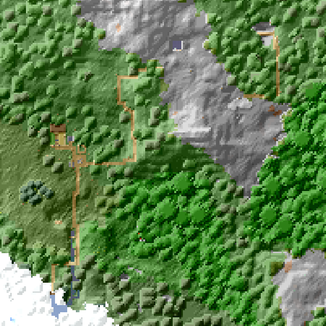

# hom-mc-server

* [Locations](#locations)
* [Nether Road Map](#nether-road-map)

## Locations

The table below shows the locations of known settlements and points of interest.

### Settlements

<table>
  <tr>
    <td><b>Map</b></td>
    <td><b>Name</b></td>
    <td><b>Coordinates</b></td>
    <td><b>Nether Road</b></td>
  </tr>
  <tr>
    <td></img></td>
    <td>Winter Village</td>
    <td><code>14 69 -10</code></td>
    <td>Yes</td>
  </tr>
  <tr>
    <td></img></td>
    <td>Wild West Town</td>
    <td><code>0 64 5852</code></td>
    <td>Yes</td>
  </tr>
  <tr>
    <td></img></td>
    <td>Dwarf City</td>
    <td><code>11281 8 2102</code></td>
    <td>Yes</td>
  </tr>
  <tr>
    <td></img></td>
    <td>Frostvale Haven</td>
    <td><code>1766 131 2508</code></td>
    <td>Yes</td>
  </tr>
  <tr>
    <td></img></td>
    <td>Coral Atoll</td>
    <td><code>12785 64 5319</code></td>
    <td>Yes</td>
  </tr>
</table>

### Other POI

<table>
  <tr>
    <td><b>Name</b></td>
    <td><b>Coordinates</b></td>
    <td><b>Nether Road</b></td>
  </tr>
  <tr>
    <td>Desert village</td>
    <td><code>-372 69 5911</code></td>
    <td>Yes</td>
  </tr>
  <tr>
    <td>Water temple 1</td>
    <td><code>-114 68 1261</code></td>
    <td>Yes</td>
  </tr>
  <tr>
    <td>Water temple 2</td>
    <td><code>-194 63 1721</code></td>
    <td>Yes</td>
  </tr>
  <tr>
    <td>Woodland Lodge</td>
    <td><code>-12191 67 4405</code></td>
    <td>Yes</td>
  </tr>
  <tr>
    <td>Jungle</td>
    <td><code>-7627 64 4035</code></td>
    <td>Yes</td>
  </tr>
  <tr>
    <td>Waste Westland</td>
    <td><code>-786 73 6167</code></td>
    <td>Yes</td>
  </tr>
</table>

## Nether Road Map

</img>